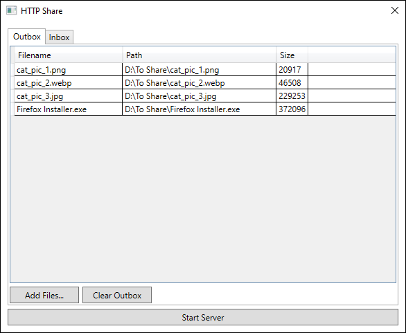

# HTTP Share

HTTP Share is a simple Windows program to quickly share files via the HTTP protocol.



## How To Use HTTP Share

1. You can add files to share to client devices by adding them to the list in the **Outbox** tab.
2. To start sharing the files, you can start the server by clicking the **Start Server** button. After starting the server, you can connect to the server using the following address:
```
http://<host device's IP address>:80
```
3. To share files to the host device, you can use the form provided in the index page. All files uploaded to the host device will appear in the **Inbox** tab.
4. You can download these files by clicking the **Download All** button.

## Running/Building HTTP Share

Before building and/or running HTTP Share, you need to make sure that your machine has the following prerequisites:

- Windows 10 or later
- [.NET 8.0 or later](https://dotnet.microsoft.com/en-us/download/dotnet/8.0):
	- .NET SDK 8.0 or later
	- .NET Runtime 8.0 or later
	- .NET Desktop Runtime 8.0 or later
- [Visual Studio 2022 (Optional)](https://visualstudio.microsoft.com/)

### Running/Building HTTP Share via Visual Studio 2022

1. Open `HttpShare.sln` with Visual Studio 2022
2. Once the solution loaded, build the project with `Build` > `Build Solution`
3. And to run the program, simply hit the _"green left-pointing triangular arrow"_ button

### Running/Building HTTP Share via the command line

To build HTTP Share via the command line, you can use the following command:

```
> dotnet build
```

To run HTTP Share via the command line, you can use the following command:

```
> dotnet run --project HttpShare
```

## Release Notes

See [CHANGELOG.md](./CHANGELOG.md)

## License

HTTP Share is licensed under the [Apache 2.0 license](./LICENSE.txt).
